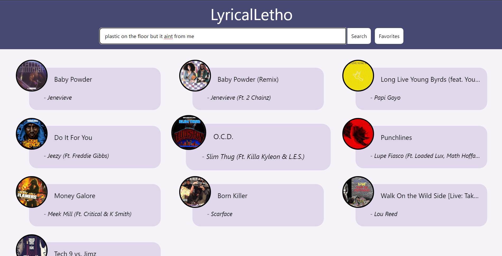

# LyricalLetho

## Description

Ever had the tip of the tongue phenomenon? How about… tip of the ear? Use LyricalLetho when you just can’t quite remember those lyrics, but you’re just on the edge of singing the rest of the song. This application allows you to search with lyrics, song titles, albums, artists and gives you a link to the song on popular streaming services in return!

## Tech Stack

  <h3>Base</h3>
  &nbsp;
  &nbsp;
  &nbsp;

  <h3>Framework</h3>
  

  <h3>APIs</h3>
      
  
  

## Usage

To use this webpage, you may open the page using the Github pages link or this [link](https://tkmarsten.github.io/team11-project-1/).

## Credits

Team 11   
[ @Victor Korn](https://github.com/vicdotexe)    [ @Tiarnan Marsten](https://github.com/tkmarsten)    [ @Alex Thiel](https://github.com/dthiel22)

## License

Please refer to the LICENSE in the repo.
